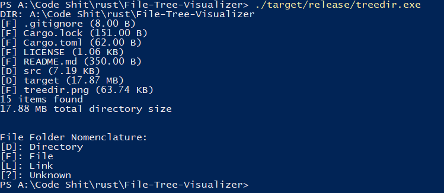

# treedir
An implementation of visualizing a file tree using a tree data structure and a GUI.

 

## Usage
See help for usage and possible args/params:
```
treedir -h
```

## Installation
No dependencies (so far) so just clone the repo and run it with cargo:
```
git clone https://github.com/VINXIS/treedir.git
cd treedir
cargo run
``` 
